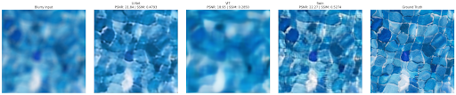
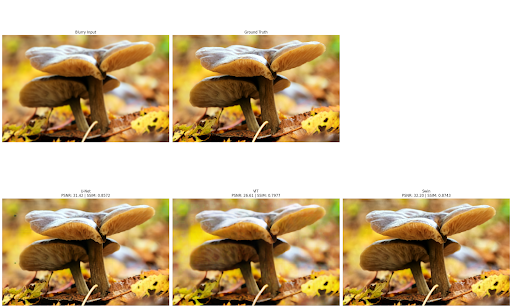

# Comparative Analysis of CNN and Transformer Architectures for Image Deblurring


A PyTorch project to implement, train, and compare three advanced deep learning models (U-Net, ViT, and Swin Transformer) for single-image deblurring.




---

## Overview

This project provides a complete, end-to-end workflow for tackling image deblurring. It automates the entire data pipeline, from downloading the DIV2K dataset to generating a synthetic training set with diverse blur types. The core of the project is a comparative study of three powerful architectures: a CNN-based **U-Net**, a **TransUNet** (ViT with a CNN decoder), and a **Swin-Unet**. The goal is to restore sharp, high-quality images from blurry inputs and rigorously evaluate which architectural approach is most effective for this image restoration task.

---

## Features

- **Three-Model Comparison:** Implements and trains a U-Net, a TransUNet (ViT), and a Swin-Unet for a comprehensive performance analysis.
- **Automated Data Pipeline:** The notebook automatically downloads the DIV2K dataset, organizes it, generates synthetic blurs (motion, Gaussian, defocus), creates a cropped training set, and splits it into train/validation sets.
- **Advanced Architectures:**
    - **U-Net:** Enhanced with `decoder_use_batchnorm=True` and `decoder_attention_type='scse'` to improve quality.
    - **TransUNet & Swin-Unet:** Implement skip connections to merge high-resolution details from the encoder with the decoder path, solving the blocky-artifact issue common in pure Transformer models.
- **Robust Training:** Utilizes a combined L1 + VGG Perceptual + SSIM Loss, a `ReduceLROnPlateau` learning rate scheduler, and an `EarlyStopping` mechanism to save time and prevent overfitting.
- **Comprehensive Evaluation:** Evaluates all three models on both random 224x224 test crops and random full-resolution images using a sliding-window inference method with padding.
- **Quantitative Analysis:** Includes a final evaluation block to calculate and compare the average PSNR and SSIM for all models across the entire test set.


---

## Setup and Installation

1.  **Clone the repository:**
    ```bash
    git clone https://github.com/PeiyaoTao/Image-Deblurring.git
    cd Image-Deblurring
    ```

2.  **Create a Conda Environment:**
    ```bash
    conda create -n deblur python=3.9
    conda activate deblur
    ```

3.  **Install PyTorch with CUDA support:**
    (Visit the [PyTorch website](https://pytorch.org/get-started/locally/) to get the command for your specific CUDA version)
    ```bash
    # Example for CUDA 12.1
    pip install torch torchvision torchaudio --index-url [https://download.pytorch.org/whl/cu121](https://download.pytorch.org/whl/cu121)
    ```

4.  **Install project dependencies:**
    ```bash
    pip install -r requirements.txt
    ```

---

## Usage Workflow

The entire project is managed through the `deblurring.ipynb` Jupyter Notebook. The cells are designed to be run sequentially.

1.  **Run Data Download & Setup Cells:** Execute the initial data preparation cells. The notebook will:
    - **Automatically download** the DIV2K dataset if it's not found.
    - Organize the images into `train` and `test` sets.
    - Generate synthetic blurry images.
    - Create a smaller, cropped dataset for efficient training.
    - Create a `validation` set from the training data.

2.  **Train Models:** Run the training cell. This will instantiate, create optimizers for, and train both the U-Net and ViT models sequentially. Final weights will be saved as `.pth` files.

3.  **Evaluate Models:** Run the final evaluation cells to see a qualitative and quantitative comparison of the trained models on both random cropped images and random full-resolution images.

---

## File Structure

```
.
├── deblurring.ipynb         # Main Jupyter Notebook for training and evaluation
├── README.md                # This README file
├── requirements.txt         # Project dependencies
└── DIV2K_train_HR/          # (Auto-generated) Original data directory
├── train/
│   ├── sharp/
│   └── blur/
└── test/
├── sharp/
└── blur/
└── cropped_dataset/         # (Auto-generated) Cropped data directory
├── train/
├── validation/
└── test/
```

---

## `requirements.txt`

```
# Core ML & CV Libraries
torch==2.5.1
torchvision==0.20.1
torchaudio==2.5.1
transformers==4.56.2
segmentation-models-pytorch==0.5.0
opencv-python==4.12.0.88
scikit-image==0.25.2
pillow==11.0.0

# Data & Utility Libraries
numpy==2.1.2
matplotlib==3.10.6
tqdm==4.67.1
requests==2.32.5

# For Transformer backbones
timm==1.0.19
einops==0.8.1
```
